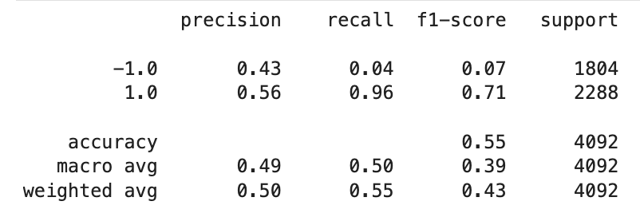
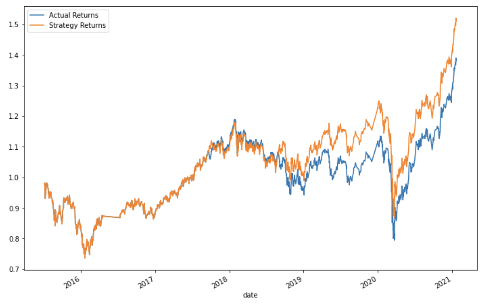
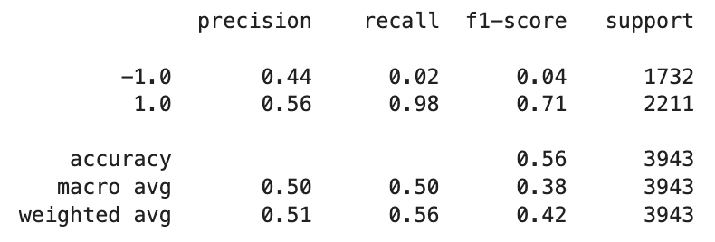
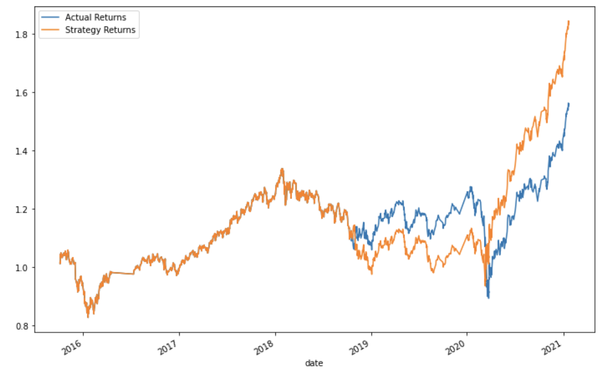
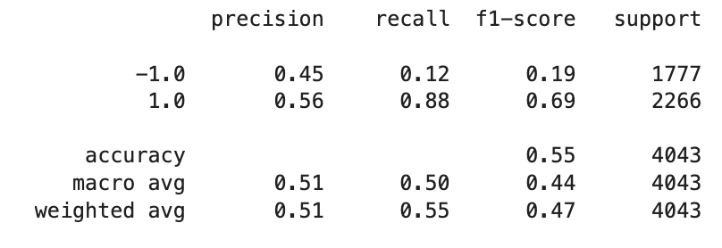
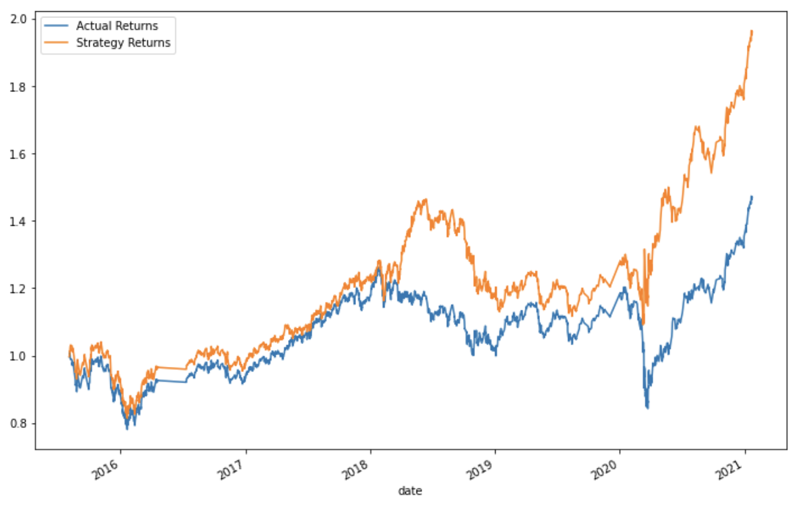
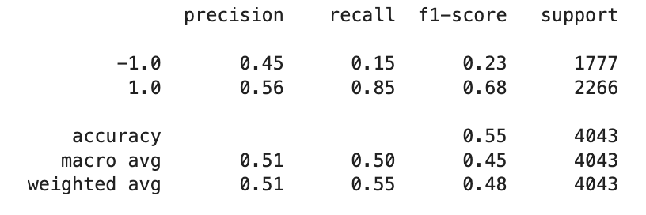
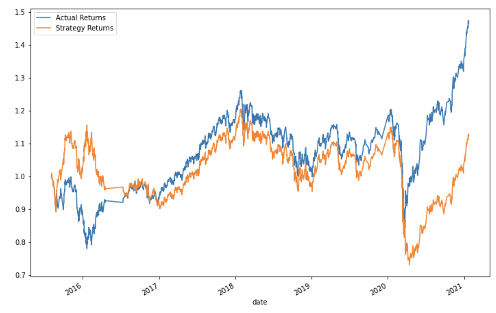

# Algorithmic-Trading

## Background

In this Challenge, you’ll assume the role of a financial advisor at one of the top five financial advisory firms in the world. Your firm constantly competes with the other major firms to manage and automatically trade assets in a highly dynamic environment. In recent years, your firm has heavily profited by using computer algorithms that can buy and sell faster than human traders.

The speed of these transactions gave your firm a competitive advantage early on. But, people still need to specifically program these systems, which limits their ability to adapt to new data. You’re thus planning to improve the existing algorithmic trading systems and maintain the firm’s competitive advantage in the market. To do so, you’ll enhance the existing trading signals with machine learning algorithms that can adapt to new data.

## Objectives

1. Establish a Baseline Performance (SVM)
2. Tune the Baseline Trading Algorithm (SVM)
3. Evaluate a New Machine Learning Classifier (Logistic Regression)
4. Final Evaluation

## Establish a Baseline Performance (SVM)

**Baseline Classification Report (SVM)**
---

**Baseline Cumulative Return Chart (SVM)**
---

- The baseline trading algorithm outperforms actual returns by approximately 10-15% cumulatively.

## Tune the Baseline Trading Algorithm (SVM)

**6 Month Test Set Classification Report (SVM)**
---

**6 Month Test Set Cumulative Return Chart (SVM)**
---

- Increasing the testing window to 6 months compared to the baseline's 3 month window improves the algorithm's cumulative returns.  The new algorithm outperforms actual returns by approximately 25-30% cumulatively.

**6 Month Test Set, 5 Short Window, & 25 Long Window Classification Report (SVM)**
---

**6 Month Test Set, 5 Short Window, & 25 Long Window Cumulative Return Chart (SVM)**
---

- Increasing the testing window to 6 months and also adjusting the short and long window to 5 & 25, respectively, improves the algorithm's cumulative returns.  The new algorithm outperforms actual returns by approximately 50-65% cumulatively.

## Evaluate a New Machine Learning Classifier

**6 Month Test Set, 5 Short Window, & 25 Long Window Classification Report (Linear Regression)**
---

**6 Month Test Set, 5 Short Window, & 25 Long Window Cumulative Return Chart (Linear Regression)**
---

- This model performed worse than the SVM model.  While this alogrithm starts off with positive returns, it eventually starts to lag in predicting the correct buy/sell signal.

## Final Evaluation

The best performing algorithm is identified below.  By increasing the testing window and adjusting the long window to be a shorter period of time, the SVM algorithm was improved compared to the baseline.  This algorithm performed better than the linear regression algorithm (using the same parameters).

**6 Month Test Set, 5 Short Window, & 25 Long Window Classification Report (SVM)**
---

**6 Month Test Set, 5 Short Window, & 25 Long Window Cumulative Return Chart (SVM)**
---

